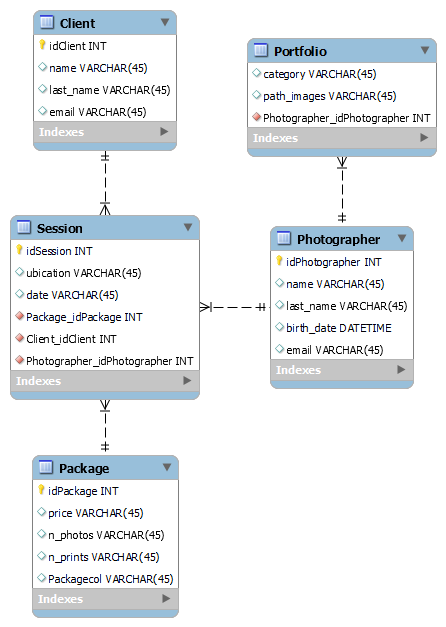

# Proyect of First Bimester
## General Info
Some items to consider into proyect:

## Table of Contents
1. [DataBase Diagram (DB)](#dataBase) => MySql Workbench
2. [MockUps](#mockUps)=> Figma
3. [User Stories](#userStories)

### 1. Database Diagram

### 2. MockUps

https://memphis-cs.github.io/comp-4081-2018-fall/project/user_stories_template.html

### 3. User Stories

-[x] Como **cliente**, quiero visualizar el portafolio del fotógrafo para decidir si agendo una sesión.
  - **Criterios de Aceptación:**
    - Como
- [ ] Como **cliente**, quiero elegir un paquete para agendar una sesión destinada a mi boda.
-[ ] Como **fotógrafo**, quiero 